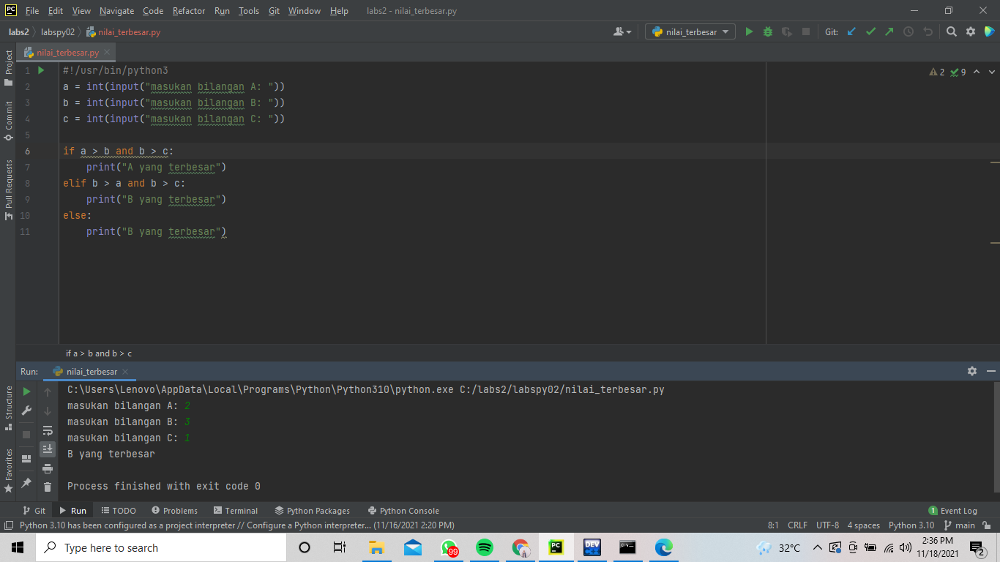
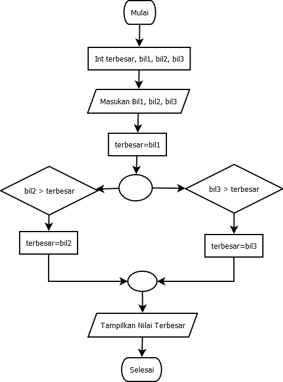

# labspy02
# Bahasa Pemrograman
# Mencari bilangan terbesar dari input 3 bilangan by Rizky Sulirahmawati 31211247

Saya memulai dengan menyiapkan 3 variabel, yaitu a, b, dan c. lalu masukkan input data ada variable tersebut dengan input 'int(input)'.
Jika sudah membuat script tesebut, selanjutnya membuat script untuk menentukan bilangan terbesarnya dengan mengggunakan if, elif, dan else statement.
Berikut contohnya programnya:

Berikut merupakan flowchartnya

